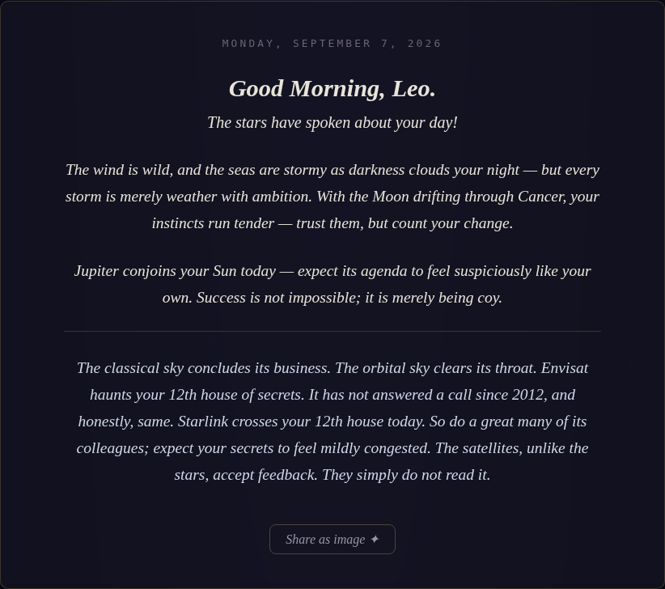
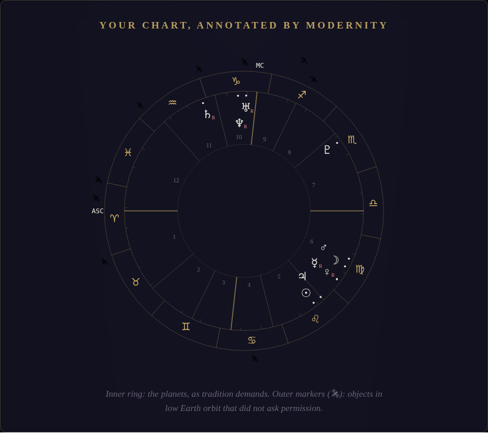

# 🛰 Orbital Oracle

*The stars have spoken about your day. So, unfortunately, have the satellites.*

A zero-backend web app that computes your **real natal chart** — tropical zodiac,
Placidus houses, arcminute-accurate planetary positions — and delivers a daily
horoscope in the voice of a fantasy academy's morning prophecies. Its one
modern contribution to a very old art: it also tracks **actual satellites**
(Starlink, the ISS, Hubble, one long-dead Envisat) through your houses via live
orbital data, because no birth chart drawn after 1957 is truly complete.

<p align="center">
  
  
</p>

**[→ Live demo](https://yllnoreshehi.github.io/orbital-oracle/)** ·


## Why it's built this way

Most horoscope apps call a paid astrology API. This one computes everything
client-side instead — which means no API keys, no backend, no user data leaving
the browser, and free hosting on GitHub Pages. It also means the astronomy is
verifiable: the test suite checks every planetary longitude, the Ascendant,
Midheaven, and all twelve Placidus house cusps against Swiss Ephemeris
reference values, and requires agreement within 0.01°.

| Layer | How |
|---|---|
| Planetary positions | [astronomy-engine](https://github.com/cosinekitty/astronomy) (VSOP87-based, MIT) |
| Houses | Placidus cusps solved numerically from sidereal time + coordinates; whole-sign fallback near the polar circles |
| Historical timezones | [tz-lookup](https://github.com/darkskyapp/tz-lookup) + the browser's IANA database — a 1991 birth gets its correct 1991 UTC offset |
| Satellites | Live [CelesTrak](https://celestrak.org) element sets, SGP4-propagated with [satellite.js](https://github.com/shashwatak/satellite-js), mapped to ecliptic longitude → sign → natal house (bundled fallback for offline use) |
| Geocoding | [Nominatim](https://nominatim.openstreetmap.org), with a built-in city atlas and manual coordinates as fallbacks |
| The daily message | Seeded generator referencing *real* transits — today's Moon sign, live aspects to your natal Sun, whether Mercury is genuinely retrograde. Deterministic per person per day: same prophecy all day, a new one at midnight, as a respectable horoscope demands |

The message engine is honest about its genre: the astronomy is real,
the interpretation is theatre.

## Run it

```bash
npx serve .          # or: python3 -m http.server
```

No build step. No runtime dependencies — the three libraries are vendored in
`js/vendor/`.

### Deploy on GitHub Pages

Push to GitHub → repo **Settings → Pages → Deploy from a branch** → `main`,
root folder. Done. A weekly GitHub Action keeps the bundled satellite elements
fresh; CI runs the ephemeris test suite on every push.

## Project layout

```
index.html            the reading room
css/style.css         night sky, gold ink, book typography
js/chart.js           natal chart math — planets, ASC/MC, Placidus   [tested]
js/satellites.js      TLE fetch + SGP4 → signs & houses              [tested]
js/horoscope.js       the voice: seeded daily message generator      [tested]
js/share.js           canvas renderer: reading → shareable PNG
js/app.js             form, geocoding, timezone handling, SVG wheel
data/tle-fallback.js  bundled orbital elements for offline mode
tools/                fallback refresh scripts
test/test.js          regression vs. Swiss Ephemeris reference values
```

```bash
npm install && npm test    # 8 checks incl. cross-hemisphere + polar edge cases
npm run refresh-tles       # update bundled satellite elements from CelesTrak
```

## Credits

Ephemeris: [astronomy-engine](https://github.com/cosinekitty/astronomy) ·
SGP4: [satellite.js](https://github.com/shashwatak/satellite-js) ·
orbital data: [CelesTrak](https://celestrak.org) ·
geocoding: © [OpenStreetMap](https://www.openstreetmap.org/copyright) contributors ·
message style: an affectionate homage to the daily horoscopes in *Zodiac Academy*.

MIT licensed. For entertainment only — the satellites hold no opinion of you.
Probably.
